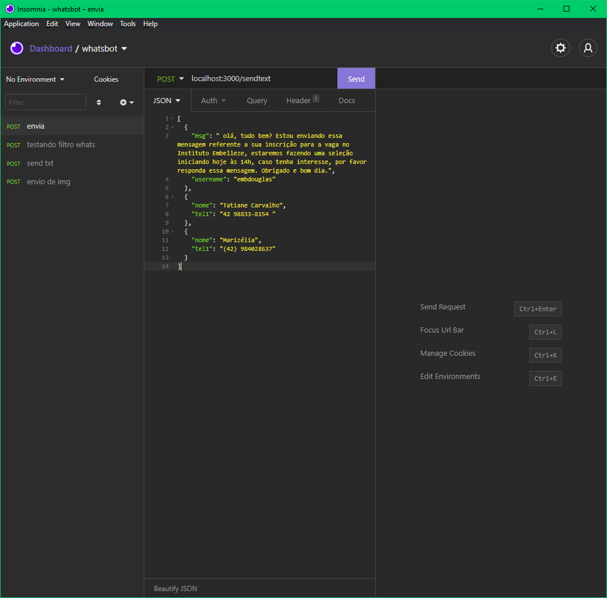
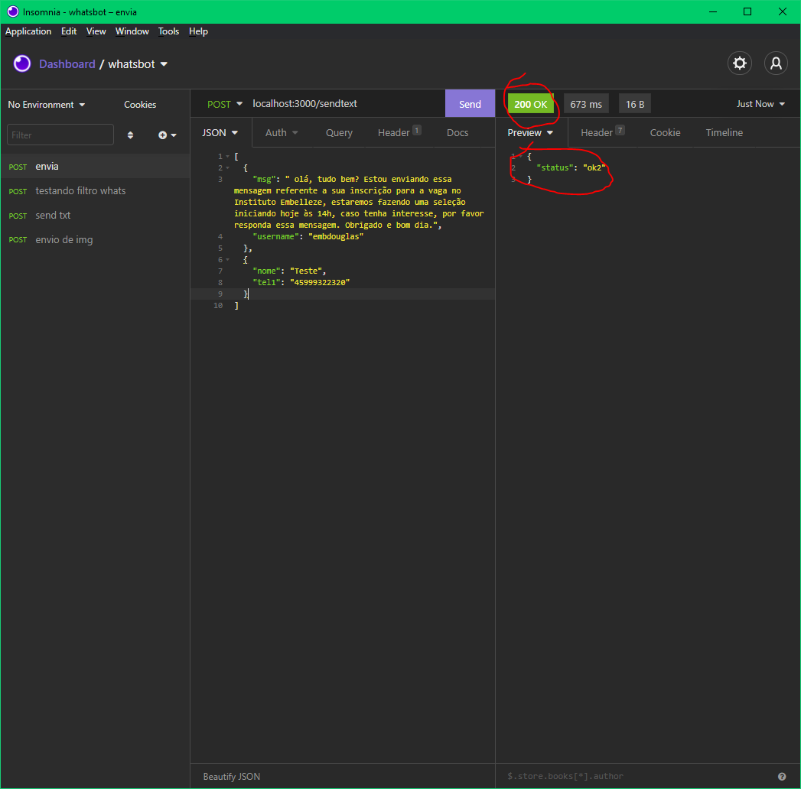

# Preparando o ambiente

## Instalação do Node
Para instalar o Node.js, acesse o site a seguir e faça download da versao LTS:

[Download Node](https://nodejs.org/en/download/)

Para verificar se a instalação foi realizada com sucesso, abra a linha de comando, cmd, e digite o seguinte comando:

`node -v`

Deverá aparecer a versão do node instalada no sistema, caso de algum erro, entre em contato.

## Rodando o programa

Agora precisamos instalar as bibliotecas necessárias para rodar o programa, para isso, abra o terminal cmd na pasta do programa e rode o seguinte comando:

`npm install`

Após instalar todas as bibliotecas, o sistema já está pronto para rodar, basta abrir a linha de comando na pasta em que estão os arquivos e rodar o comando:

`node index.js`

Esse comando fará o sistema rodar na porta 3000 enquanto estiver aberto e aparecer a seguinte mensagem no terminal:

`servidor rodando na porta 3000 `

## Utilizando o sistema

Ainda não tem uma parte visual para uso fora do CRM, então para fazer os envios em massa será necessário o uso de um software para as requisições rest.
Para isso usaremos o Insomnia:

[Download Insomnia](https://insomnia.rest/download)

A utilização dele é bem simples, basta criar uma requisição do tipo POST com o link: 

`localhost:3000/sendtext`

com o body do tipo JSON com o seguinte formato: 

```
[
	{
		"msg": " olá, tudo bem? Estou enviando essa mensagem referente a sua inscrição para a vaga no Instituto Embelleze, estaremos fazendo uma seleção iniciando hoje às 14h, caso tenha interesse, por favor responda essa mensagem. Obrigado e bom dia.",
		"username": "luizer"
	},
	{
		"nome": "Teste 1",
		"tel1": "42 99999-9999"
	},
	{
		"nome": "Teste 2",
		"tel1": "(42) 99999999"
	}
]
```

O primeiro jogo de chaves {} irá a mensagem e o "username", nos próximos vão os contatos para envio de mensagem, eles devem estar dentro desse padrão chamado JSON, nome e tel1. Caso tenha dificuldades para gerar essa lista, crie um excel, com a primeira coluna com o cabeçalho nome a a segunda tel1 e utilize esse site para converter:

[Conversor Excel to JSON](https://beautifytools.com/excel-to-json-converter.php)

A imagem do Insomnia deve ficar semelhante a essa:



Após realizar essa simples configuração, basta clicar no botão Send, se tudo estiver certo ele retornará a mensagem de Status: ok2 como na imagem:



Em sequência, no terminal, caso seja a primeira vez abrindo o whatsapp, ele irá pedir o QRCODE, basta fazer o login lendo o mesmo no terminal e ele irá enviar as mensagens.
Caso ocorra algum erro no login, basta fechar o terminal, reabrir e digitar o comando para iniciar e dar o Start no Insomnia.